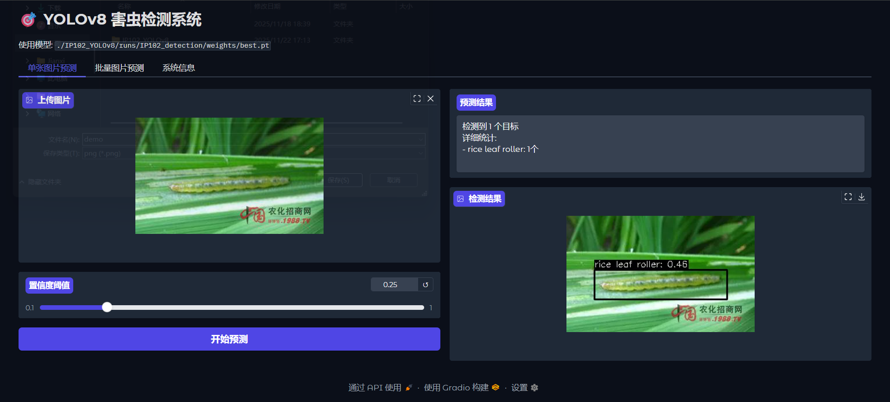
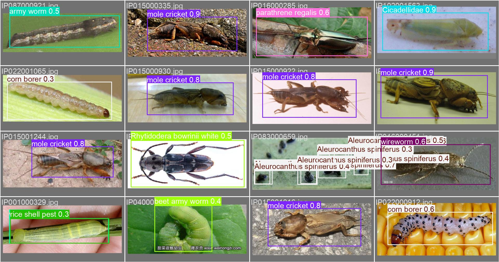

# 🎯 YOLOv8 害虫检测系统



基于YOLOv8的农业害虫目标检测系统，能够识别和定位102种不同类型的害虫。本项目使用YOLOv8深度学习模型，对IP102害虫数据集进行训练，实现高效的害虫检测和识别。系统提供Web界面，支持单张图片预测、批量图片预测等功能。

## 🗂️ 项目结构

```
PestYOLO/
├── IP102_v1.1/                    # 原始数据集
│   └── Detection/
│       └── VOC2007/
│           ├── Annotations/       # XML标注文件
│           ├── ImageSets/
│           │   └── Main/          # 训练/测试集划分
│           └── JPEGImages/        # 原始图片
├── IP102_YOLOv8/                  # YOLO格式数据集
│   ├── train/
│   │   ├── images/               # 训练图片
│   │   └── labels/               # YOLO格式标签
│   ├── val/
│   │   ├── images/               # 验证图片
│   │   └── labels/               # YOLO格式标签
│   ├── runs/
│   │   └── IP102_detection/
│   │       └── weights/
│   │           └── best.pt       # 训练好的模型权重
│   ├── classes.txt               # 害虫类别列表
│   └── data.yaml                 # 数据集配置文件
├── main.py                       # 主程序 - Web界面
├── download_IP102.PY            # 数据集下载脚本
├── voc2yolo.py                  # 数据格式转换脚本
├── train.py                     # 模型训练脚本
├── predict_image.py             # 单张图片预测脚本
└── README.md                    # 项目说明文档
└── 基于yolo的病虫害目标检测.ipynb   # 项目训练脚本
```

## 🚀 快速开始

### 环境要求

- Python 3.8+
- CUDA 11.0+ (GPU训练推荐)
- 至少8GB RAM

### 安装依赖

```bash
pip install ultralytics gradio opencv-python pillow gdown
```

### 数据集准备

1. **下载数据集**
```bash
python download_IP102.PY
```

2. **转换数据格式**
```bash
python voc2yolo.py
```

### 模型训练

```bash
python train.py
```

训练配置：
- 模型: YOLOv8n (可替换为yolov8s.pt/yolov8m.pt)
- 轮数: 30 epochs
- 批次大小: 16
- 图片尺寸: 640x640

### 启动Web界面

```bash
python main.py
```

访问 http://localhost:7860 使用害虫检测系统。

## 🎮 功能特性

### 🔍 单张图片预测
- 上传单张图片进行害虫检测
- 实时显示检测框和置信度
- 详细的检测结果统计

### 📁 批量图片预测
- 支持多张图片批量处理
- 生成检测结果图库
- 处理进度和结果汇总

### ⚙️ 系统信息
- 模型详细信息展示
- 害虫类别列表
- 使用说明文档

## 📊 数据集信息

### IP102害虫数据集
- **类别数量**: 102种害虫
- **图片数量**: 训练集 + 验证集
- **标注格式**: Pascal VOC → YOLO格式

### 主要害虫类别
包括但不限于：
- 稻纵卷叶螟 (rice leaf roller)
- 褐飞虱 (brown plant hopper)
- 玉米螟 (corn borer)
- 蚜虫 (aphids)
- 斜纹夜蛾 (Prodenia litura)

## 🛠️ 核心脚本说明

### `download_IP102.PY`
- 自动下载IP102数据集
- 解压和验证数据完整性
- 创建标准目录结构

### `voc2yolo.py`
- 将Pascal VOC格式转换为YOLO格式
- 生成训练/验证集划分
- 创建data.yaml配置文件

### `train.py`
- YOLOv8模型训练脚本
- 支持多种YOLOv8模型变体
- 自动保存最佳权重

### `main.py`
- Gradio Web界面
- 实时害虫检测
- 用户友好的交互设计

## 📈 模型性能

- **输入尺寸**: 640x640
- **置信度阈值**: 可调节 (默认0.25)
- **检测类别**: 102种害虫
- **推理速度**: 实时检测

## 🎯 使用示例

### 单张图片检测
```python
from ultralytics import YOLO

model = YOLO("./IP102_YOLOv8/runs/IP102_detection/weights/best.pt")
results = model.predict("image.jpg", conf=0.25)
```

### 批量检测
```python
results = model.predict(["img1.jpg", "img2.jpg"], save=True)
```

## 🔧 自定义配置

### 调整置信度阈值
在Web界面中滑动调节或在代码中设置：
```python
results = model.predict(source=image, conf=0.5)  # 更高阈值
```

### 使用不同模型
在`train.py`中修改：
```python
model = YOLO("yolov8s.pt")  # 更大型号
```

## 📝 注意事项

1. **首次运行**需要下载数据集和训练模型
2. **GPU加速**推荐用于训练和快速推理
3. **内存要求**批量处理时注意系统内存
4. **文件路径**确保数据集路径正确配置

## 🤝 贡献

欢迎提交Issue和Pull Request来改进这个项目！

## 📄 许可证

本项目仅供学习和研究使用。

## 📞 联系方式

如有问题，请通过项目Issue反馈。

---

**开始使用**: 按照快速开始步骤安装环境并运行Web界面，体验高效的害虫检测系统！